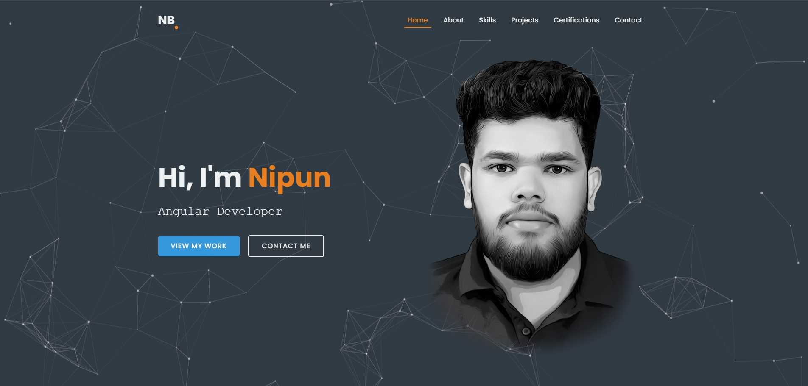
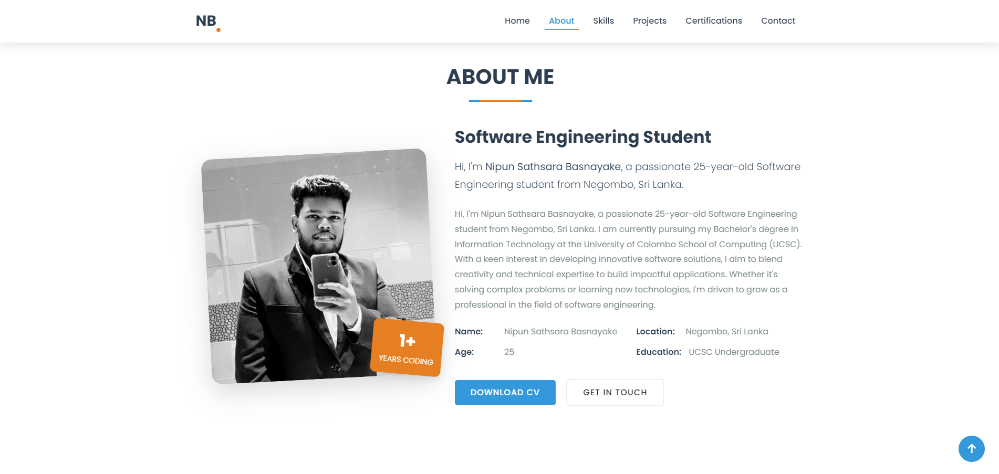
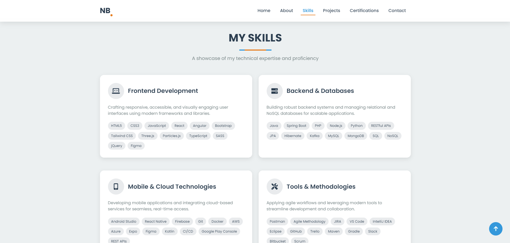
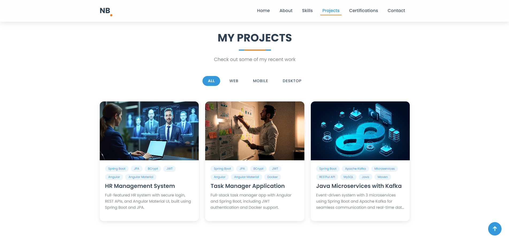
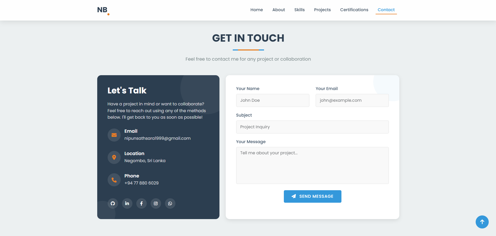

# **Nipun Basnayake - Portfolio Website**

## **Overview**
A modern, responsive portfolio website showcasing my skills, projects, and certifications as a Software Engineering student at University of Colombo School of Computing (UCSC). The website features interactive elements, smooth animations, and a clean UI design to effectively present my professional profile.

---

## **Features**

### **Interactive UI**:
- Particle.js animated background in hero section
- Typewriter effect for dynamic text animation
- Smooth scrolling navigation
- Responsive design for all device sizes
- Dark/light mode based on system preferences

### **Project Showcase**:
- Filterable project gallery (Web/Mobile/Desktop)
- Project cards with tags and descriptions
- Live demo and GitHub links
- Responsive image loading

### **Professional Profile**:
- About me section with personal information
- Skills categorized by expertise areas
- Certification display with verification links
- Downloadable resume/CV

### **Contact System**:
- Functional contact form with validation
- Direct social media links
- Email and phone contact information
- Form submission handling with FormSubmit

---

## **Technologies Used**

### **Frontend**:
- HTML5, CSS3, JavaScript (ES6+)
- Bootstrap 5
- Font Awesome Icons
- Google Fonts (Poppins)

### **Libraries**:
- AOS (Animate On Scroll)
- Typed.js (Typewriter effect)
- Particles.js (Interactive background)
- FormSubmit (Contact form handling)

### **Performance**:
- Preloader with progress animation
- Optimized assets and images
- Lazy loading for better performance
- Minified CSS/JS in production

---

## **Website Structure**

The portfolio follows a single-page application structure with distinct sections:

1. **Hero Section**: Introduction with animated elements
2. **About Section**: Personal profile and information
3. **Skills Section**: Technical skills categorization
4. **Projects Section**: Filterable project gallery
5. **Certifications Section**: Professional certifications
6. **Contact Section**: Contact form and social links

---

## **Project Documentation**

### **Data Management**
All dynamic content is managed through:
- `data.js` for personal information and content
- JSON-like structures for projects and certifications
- Modular JavaScript for easy updates

### **Animation System**
- AOS for scroll-triggered animations
- Custom CSS animations for UI elements
- JavaScript-controlled progress animations

### **Form Handling**
- Client-side validation
- FormSubmit.co integration
- Success/error message handling

---

## **Screenshots**

*Hero section with particle background and typewriter effect*

*About me section with personal information*

*Skills display with categorized badges*

*Filterable projects gallery*

*Contact form with social media links*

---

## **License**

This project is licensed under the MIT License - see the [LICENSE](LICENSE) file for details.

---

## **Contact**

For professional inquiries or collaborations:
- Email: [nipunsathsara1999@gmail.com](mailto:nipunsathsara1999@gmail.com)
- Phone: +94 77 880 6029
- LinkedIn: [NipunBasnayake](https://www.linkedin.com/in/nipunbasnayake/)
- GitHub: [NipunBasnayake](https://github.com/NipunBasnayake)

